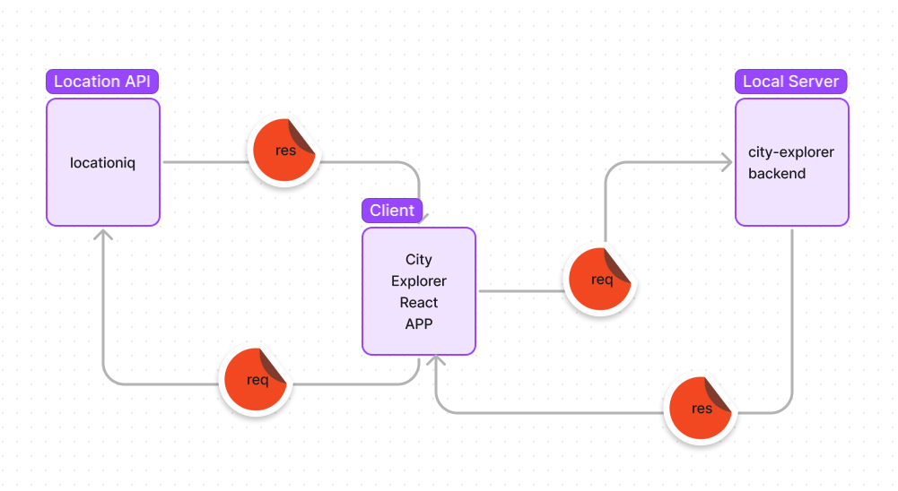

# City Explorer API

**Author**: Mandy Mason

**Version**: 1.2.0 

## Overview
Backend server for City Explorer which provides weather information to the client upon request.

## Getting Started
Clone this repo from GitHub
Install dependencies

## Architecture
Express, Dotenv, Cors, Node

## Change Log
Initial setup: 7/19/2022
Weather from data.json: 7/20/2022
Live Weather and Movie info: 7/21/2022

## Lab 07

### Whiteboard of WRRC 

Collab: Anthony Johnson

## Features

**Name of feature: #1 - Initial Setup** 

Estimate of time needed to complete: 30 minutes

Start time: 9:25pm

Finish time: 9:55pm

Actual time needed to complete: 25 minutes

**Name of feature: #2 - Weather** 

Estimate of time needed to complete: 2.5 hours

Start time: 10:00pm (paused @ 12:30am - incomplete / resume 3:30pm following day)

Finish time: 7:30pm (next day)

Actual time needed to complete: 5 hours

## Lab 08

### Whiteboard of WRRC 

Collab: Caelin Hargrave

## Features

**Name of feature: #1 - Weather (live)** 

Estimate of time needed to complete: 2 hours

Start time: 11:00pm

Finish time: 9:00pm (following day)

Actual time needed to complete: 4.5 hours

**Name of feature: #2 - Movie Data** 

Estimate of time needed to complete: 2 hours

Start time: 9:30pm

Finish time: 1:00am

Actual time needed to complete: 3.5 hours

## Lab 09

### Whiteboard of WRRC 

Collab: Austin Limanek

**Name of feature: #1 - Modularize** 

Estimate of time needed to complete: 1 hour

Start time: 11:00am

Finish time: 11:40am

Actual time needed to complete: 40 minutes

## Credit and Collaborations

HUGE THANKS to Jacob Knaack for demo code and explanations!!
Kassie Bradshaw, Tammy Do - help connecting APIs to server
Joshua Frazer - modularization
